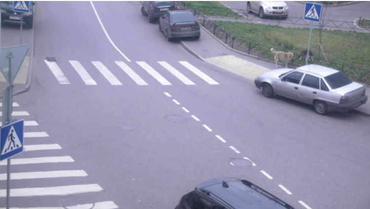
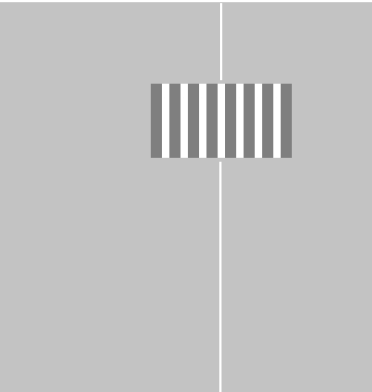

## Detection

Проект для оценки занятости парковочных мест по видеопотоку с камеры.

### Структура проекта

- **`parking.mp4`** – исходное видео парковки.
- **`grafika.py`** – расчёт гомографии.
- **`detection.py`** – основная логика детекции машин и анализа занятости мест.
- **`occupancy_frame1.json`** – пример результата анализа первого кадра (номер места и вероятность занятости).

### Пример результата оценки занятости парковочных мест

### Детекция и анализ занятости на основе стороннего проекта

Фрагмент демонстрационного видео: 
https://github.com/user-attachments/assets/18e2cad4-2d3b-4edb-a0e2-4e7f1781211c

### Пример гомографии с OpenCV на Python

