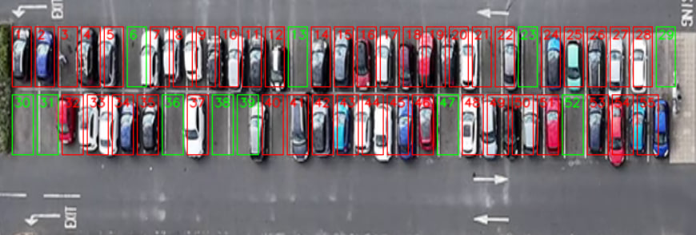
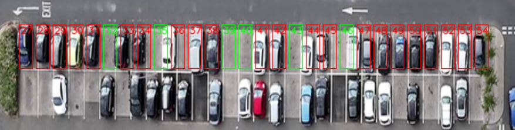
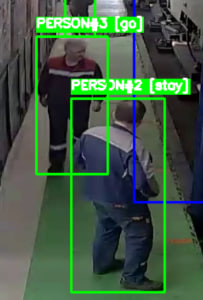
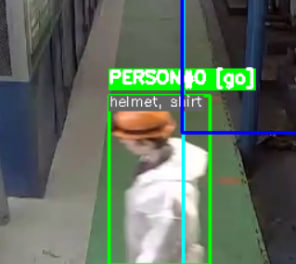
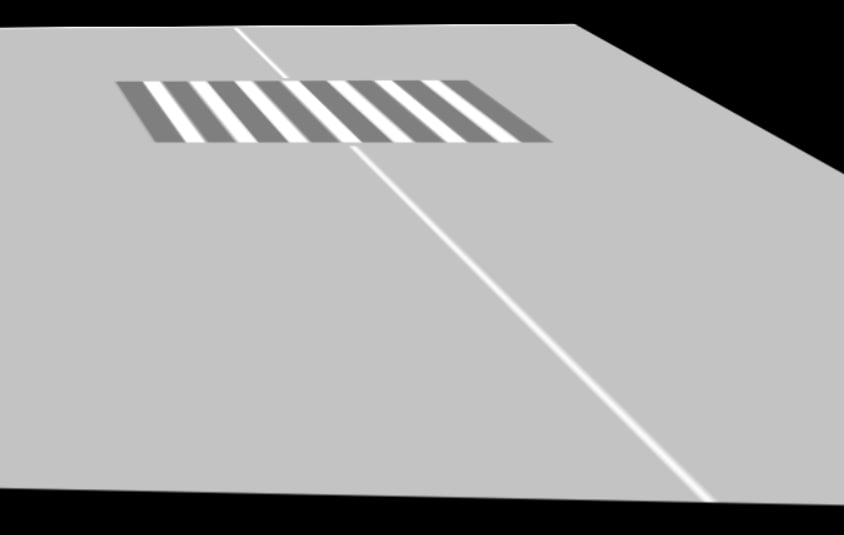

## Parking Occupancy Detection

Проект для оценки занятости парковочных мест по видеопотоку с камеры.

### Структура проекта

- **`parking.mp4`** – исходное видео парковки.
- **`grafika.py`** – расчёт гомографии.
- **`detection.py`** – основная логика детекции машин и анализа занятости мест.
- **`occupancy_frame1.json`** – пример результата анализа первого кадра (номер места и вероятность занятости).

### Пример вида сверху

### Пример результата оценки занятости парковочных мест

### Детекция и анализ занятости на основе стороннего проекта

Фрагмент демонстрационного видео: `demonstration/rzd_video.mp4`

### Пример гомографии с OpenCV на Python

